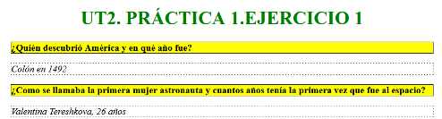
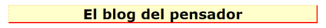
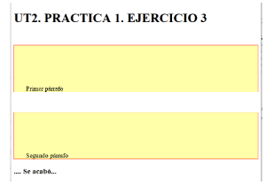
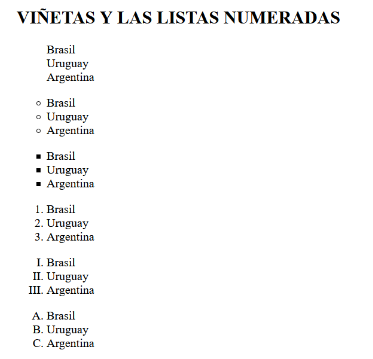
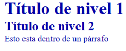
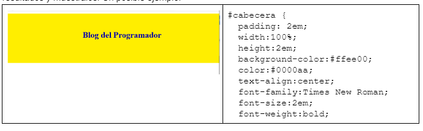
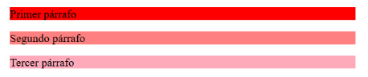

# U.T. 2 .- USO DE ESTILOS
# PRÁCTICA 1.1. REPASO DE ESTILOS CSS. 

## Objetivo: 

Repasar los estilos CSS a través de propuestas sencillas, trabajando: clases, identificadores, cajas, menús, pseudoclases, pseudoelementos, tablas y posiciones.

## Desarrollo

Se realizarán las tareas enunciadas a continuación, utilizando los materiales aportados por la profesora y consultas de bibliografía e Internet. Elaborando los ficheros necesarios, documentando debidamente con los comentarios oportunos


1.  A partir de ut2pr1ej1.html. 
El texto del encabezado está centrado y es de color verde
Definir dos párrafos que representen una pregunta y una respuesta. Inicializar estilos para el borde (ancho:1px, estilo, color) y  el color de fondo. 
*Fíjate*: el texto de la pregunta está en negrita y la respuesta en cursiva...
Deberá visualizarse:




2.  A partir del fichero ut2pr1ej2Borde.html Crear una clase .titulopagina que inicialice independientemente el grosor (3px y 1px), estilo y color de la propiedad del borde del encabezado como se visualiza en el ejemplo.El tipo de letra fuente del texto es Verdana y el tamaño 40 px.




3. Mostrar dos párrafos como se ve en la siguiente imagen. Observa que: El margen entre párrafos es de 50px en la parte de arriba del párrafo, La distancia entre el borde y el texto por la izquierda es de 30px y por arriba de 100px. El ancho del borde es de 1px.




4. A partir de ut2pr1ej4lista.html, probar los valores posibles que puede tomar la propiedad list-style-type en un conjunto de listas de HTML para que se visualice:




5. A partir del fichero ut2pr1ej5Universal.html, hacer pruebas con el selector universal, de forma que para todos los elementos de la página el color será: #0000aa, el margen: 0 y el padding: 0
La página web deberá visualizarse:




6. Dado el fichero ut2pr1ej6unidades.html con un div, configura las propiedades width, height, padding y font-size con las posibles variables de las unidades de medida: px, em, rem y %. Observa los resultados y muestralos. Un posible ejemplo:




````
#cabecera {
  padding: 2em;
  width:100%;  
  height:2em;
  background-color:#ffee00;
  color:#0000aa;
  text-align:center;
  font-family:Times New Roman;
  font-size:2em;
  font-weight:bold;
````

7. Mostrar tres párrafos pintando su fondo, utilizar distintas sintaxis para inicializar el color de la propiedad background-color. https://www.w3schools.com/css/css_colors.asp  Un ejemplo de visualización:




## Evaluación

Los resultados de las tareas realizadas se entregará la url del repositorio, enlazados con un fichero index.html que estará publicado en github pages
